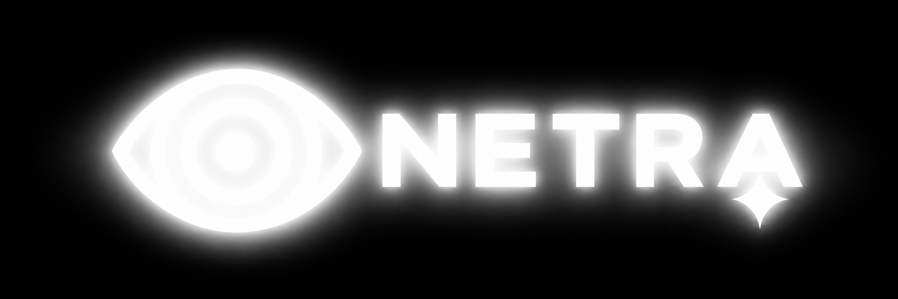
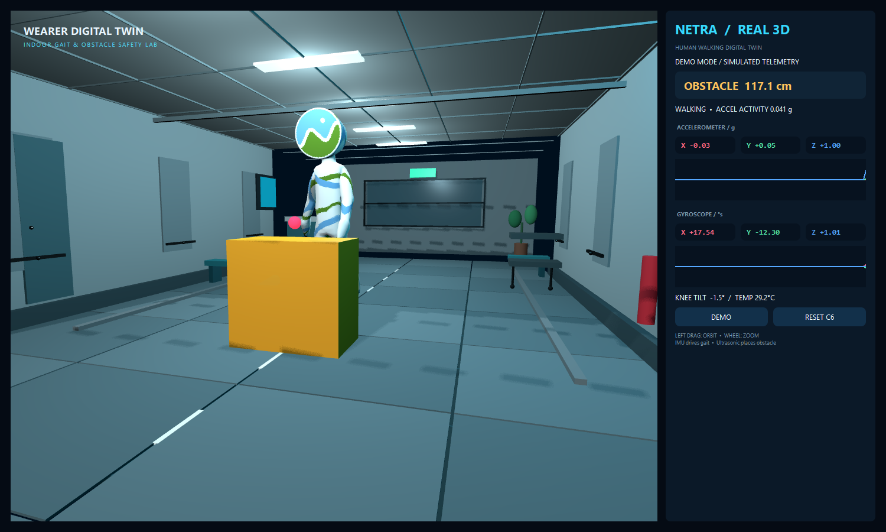
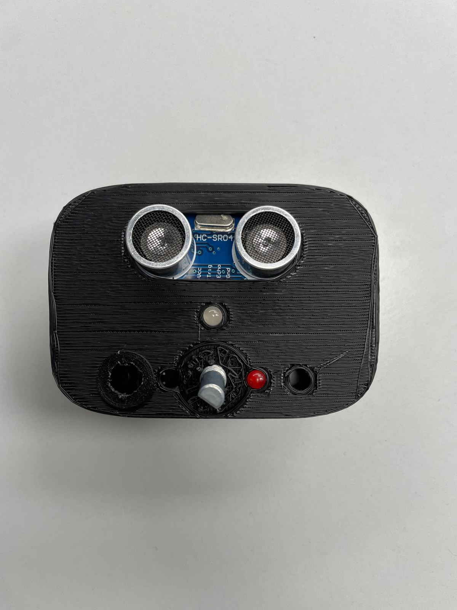
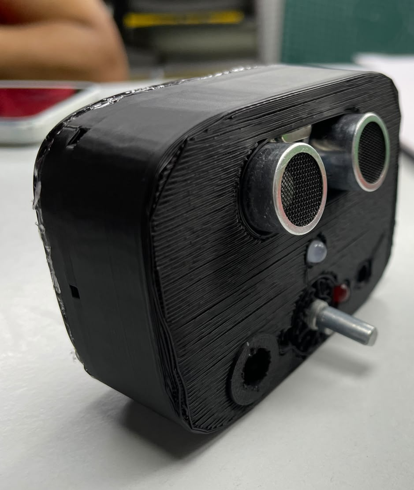

<p align="center">
  
</p>

<div align="center">

# NETRA System Debugger V1

### Live PySide6 telemetry, diagnostics, and a 3D wearable digital twin

[](https://www.python.org/)
[](https://doc.qt.io/qtforpython-6/)
[](https://doc.qt.io/qt-6/qtquick3d-index.html)
[](https://pyserial.readthedocs.io/)


Desktop tooling for viewing NETRA obstacle range, IMU motion, sensor health, and a live articulated 3D scene.

**Built for Claude Community Events @ Impact Lab.**

</div>

## Preview



<p align="center">
  
  
</p>

## What it provides

- Live USB serial connection with automatic reconnection
- HC-SR04 distance and danger-state visualization
- MPU6050 accelerometer, gyroscope, and temperature telemetry
- Scrolling six-axis plots and sensor health indicators
- Qt Quick 3D human digital twin, environment, knee sensor, and obstacle
- Demo mode for running the interface without connected hardware
- ESP32-C6 reset control and a lightweight Tkinter fallback

## Requirements

- Windows 10/11
- Python 3.10 or newer (64-bit recommended)
- NETRA firmware streaming its CSV protocol at 115200 baud
- A free serial port such as `COM6`

The matching firmware is maintained in [Netra Device Firmware V1](../Netra_Device_Firmware_V1).

## Build from source

Open PowerShell in the repository root.

```powershell
python -m venv .venv
Set-ExecutionPolicy -Scope Process Bypass
.\.venv\Scripts\Activate.ps1
python -m pip install --upgrade pip
python -m pip install -r requirements.txt
```

This creates an isolated environment and installs PySide6 plus PySerial. No compilation step is required for normal source use.

## Run

1. Flash the companion NETRA firmware.
2. Connect the ESP32-C6 and identify its port in **Device Manager → Ports (COM & LPT)**.
3. Close Arduino Serial Monitor; only one application can use a COM port at once.
4. Start the debugger, replacing `COM6` as needed:

```powershell
python .\netra_3d_gui.py --port COM6 --baud 115200
```

Or use the launcher:

```powershell
.\run_debugger.ps1 -Port COM6
```

Click **DEMO** after launch to generate simulated movement and obstacle data without hardware. The lightweight fallback can be started with:

```powershell
python .\netra_gui.py --port COM6 --baud 115200 --demo
```

## Build a Windows executable

Install the development dependency and run the included packaging script:

```powershell
python -m pip install -r requirements-dev.txt
.\build_windows.ps1
```

The unpacked application is created at:

```text
dist\Netra_System_Debugger_V1\Netra_System_Debugger_V1.exe
```

Keep the generated folder together when copying it to another PC; it contains the Qt runtime, QML scene, and 3D assets.

## Expected device stream

The debugger ignores boot banners and waits for ten-column CSV rows:

```text
distance_cm,echo_us,ax_g,ay_g,az_g,gx_dps,gy_dps,gz_dps,temp_c,status
24.63,1436,0.012,-0.021,0.998,0.31,-0.18,0.07,28.41,RANGE_OK|IMU_OK
```

## Controls

| Control | Action |
|---|---|
| **DEMO** | Toggle simulated live sensor data |
| **RESET C6** | Pulse the serial control line to reset the device |
| Left-drag | Orbit the 3D view |
| Mouse wheel | Zoom the 3D view |

## Troubleshooting

| Symptom | Fix |
|---|---|
| `Access is denied` or port busy | Close Arduino Serial Monitor and any other serial tool |
| Waiting for `COM6` | Pass the actual port with `--port COMx` |
| ROM/download-mode message | Click **RESET C6** or tap the board's reset button |
| QML/3D scene is blank | Reinstall with `python -m pip install --force-reinstall -r requirements.txt` |
| `IMU_ERROR` | Check MPU6050 power, common ground, SDA, SCL, and address |
| `RANGE_TIMEOUT` | Check HC-SR04 power/echo wiring and put a flat target in range |

For raw inspection or CSV capture, use:

```powershell
.\monitor.ps1 -Port COM6 -Csv
```

## Repository layout

```text
Netra_System_Debugger_V1/
├── netra_3d_gui.py       # PySide6 application
├── netra_scene.qml       # Qt Quick 3D scene
├── netra_gui.py          # serial reader and Tkinter fallback
├── assets/               # 3D model resources
├── monitor.ps1           # raw serial monitor/logger
├── run_debugger.ps1      # convenience launcher
├── build_windows.ps1     # PyInstaller packaging
├── requirements.txt
└── docs/images/
```
